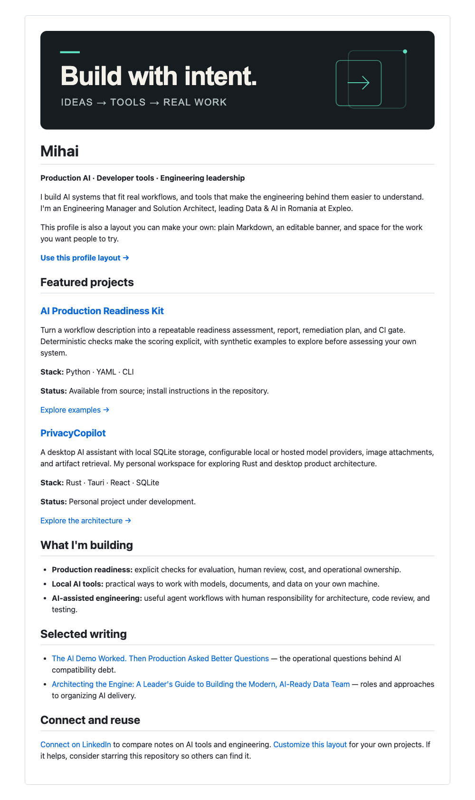
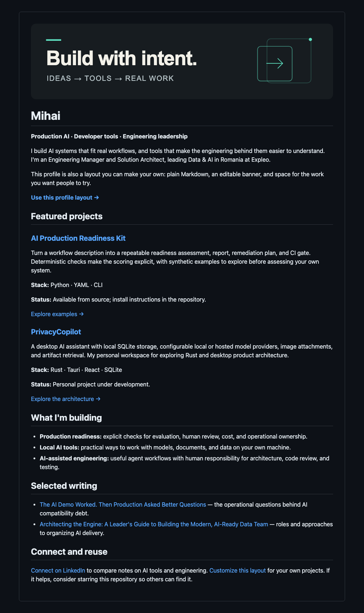

# Make this profile yours

A minimal GitHub profile for builders: a static banner, two project showcases, writing, and contact links. Everything is editable in GitHub's file editor. No packages, scripts, API keys, or Actions are needed.

## Preview

These browser-rendered previews approximate GitHub Markdown in light and dark themes. GitHub controls the actual profile typography and spacing; the banner stays charcoal in both themes.

### Light

### Dark

## 1. Choose your setup path

**No existing profile repository:** Fork this repository into your personal account. In the fork's Settings → General, rename the repository to your exact GitHub username. For example, `river-builder` needs `river-builder/river-builder`. Keep it public.

**Already have a username repository:** Keep it. Copy the neutral template into its root `README.md`, copy `assets/banner.svg`, `template/README.md`, this guide, `CONTRIBUTING.md`, and `LICENSE`. Copy `assets/previews/` too if keeping this guide's preview section, or remove that section. Merge the license scope notice into your existing licensing documentation instead of replacing an existing license. Do not overwrite your current profile until you have saved a copy.

GitHub's [profile README requirements](https://docs.github.com/en/account-and-profile/how-tos/profile-customization/managing-your-profile-readme) explain the public repository and naming rules.

## 2. Start with the neutral template

Open [template/README.md](template/README.md), choose its raw view, and copy the contents. Replace the contents of your root `README.md` with that text. The template's relative links intentionally target the repository root; they will not preview correctly inside the `template/` folder.

Replace every `{{TOKEN}}`, including image alternative text and URLs. The token names describe what belongs there: name, tagline, introduction, two projects, three focus areas, two articles, and a contact link. Remove the opening HTML comment when finished.

Use a full `https://` URL for each external destination. Name links by their destination or action, such as “Read the architecture” or “Try the demo.” State whether each project is experimental, under development, or released. Delete any project, writing, or focus section you cannot fill with real work.

## 3. Edit or remove the banner

Open `assets/banner.svg` as text. Edit its two `<text>` nodes, `<title>`, and `<desc>`. Keep the headline short (roughly 18 characters) and the subtitle under 30 characters. Escape `&` as `&amp;` and `<` as `&lt;` in SVG text. Longer text needs a smaller `font-size` and a visual check.

The palette is charcoal `#171c20`, off-white `#f3f1e9`, and teal `#5ee0c0`. Keep strong contrast if you change it. No external fonts or resources are loaded.

Replace the Markdown image's alternative text to match your banner. Keep your name and tagline in Markdown so readers do not depend on the image. To omit the banner, remove the first image line; the rest of the layout stands on its own.

## 4. Check your profile

- Search the root README for `{{` and `}}`; neither should remain.
- Confirm your name, projects, articles, and contact URLs all belong to you. Start from the neutral template rather than adapting Mihai's biography.
- Open every link and confirm the banner loads. Relative links such as `assets/banner.svg` work after copying to the root.
- Use GitHub Preview, then inspect the profile in light and dark themes and on a narrow screen.
- Confirm your public username repository has a nonempty root `README.md`, then open your profile page. Allow a refresh for GitHub to display changes.
- If you omit the customization guide, remove both links to it from your README. If you remove `template/`, remove this guide's link to it too.

You can remove the original launch drafts and preview images from your copy. Remove this guide's preview section if deleting the images. Preserve the license notice for the reused design and template.

## Reuse and contributions

The neutral template, original SVG, layout, and setup documentation are available under the [MIT license](LICENSE). Retain its copyright and permission notice. A visible attribution link or star is optional. Personal biographical statements, personal article content, and third-party projects are not supplied as reusable template content. Preview images show the example profile; replace them if using previews to represent yourself.

See [contribution guidance](CONTRIBUTING.md) to suggest clearer instructions or accessible layout improvements. If copying this guide into an existing repository, copy that file too or remove this sentence.
