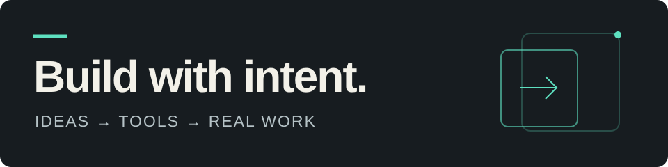

# Mihai

**Production AI · Developer tools · Engineering leadership**

I build AI systems that fit real workflows, and tools that make the engineering behind them easier to understand. I'm an Engineering Manager and Solution Architect, leading Data & AI in Romania at Expleo.

This profile is also a layout you can make your own: plain Markdown, an editable banner, and space for the work you want people to try.

**[Use this profile layout →](CUSTOMIZE.md)**

## Featured projects

### [AI Production Readiness Kit](https://github.com/mihaibc/ai-production-readiness-kit)

Turn a workflow description into a repeatable readiness assessment, report, remediation plan, and CI gate. Deterministic checks make the scoring explicit, with synthetic examples to explore before assessing your own system.

**Stack:** Python · YAML · CLI

**Status:** Available from source; install instructions in the repository.

[Explore examples →](https://github.com/mihaibc/ai-production-readiness-kit/tree/main/examples)

### [PrivacyCopilot](https://github.com/mihaibc/PrivacyCopilot)

A desktop AI assistant with local SQLite storage, configurable local or hosted model providers, image attachments, and artifact retrieval. My personal workspace for exploring Rust and desktop product architecture.

**Stack:** Rust · Tauri · React · SQLite

**Status:** Personal project under development.

[Explore the architecture →](https://github.com/mihaibc/PrivacyCopilot#current-architecture)

## What I'm building

- **Production readiness:** explicit checks for evaluation, human review, cost, and operational ownership.
- **Local AI tools:** practical ways to work with models, documents, and data on your own machine.
- **AI-assisted engineering:** useful agent workflows with human responsibility for architecture, code review, and testing.

## Selected writing

- [The AI Demo Worked. Then Production Asked Better Questions](https://www.linkedin.com/pulse/ai-demo-worked-production-asked-better-questions-mihai-baluta-cujba-vcjue/) — the operational questions behind AI compatibility debt.
- [Architecting the Engine: A Leader's Guide to Building the Modern, AI-Ready Data Team](https://www.linkedin.com/pulse/architecting-engine-leaders-guide-building-modern-mihai-baluta-cujba-ow0gf/) — roles and approaches to organizing AI delivery.

## Connect and reuse

[Connect on LinkedIn](https://www.linkedin.com/in/mihaibc) to compare notes on AI tools and engineering. [Customize this layout](CUSTOMIZE.md) for your own projects. If it helps, consider starring this repository so others can find it.
